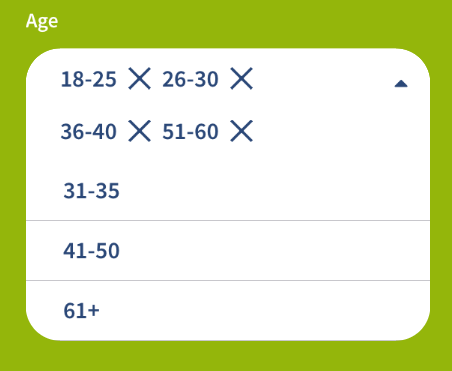

# BSSelectableView





## Installation

`BSSelectableView` is available through [CocoaPods](https://cocoapods.org/pods/BSSelectableView). To install
it, simply add the following line to your Podfile:

```ruby
pod "BSSelectableView"
```

If you used `use_framework` in your podfile just simply do:

```Swift
import BSSelectableView

```

for every file when you need to use it.

you may also use:

```Swift
@import BSSelectableView;

```

within **bridging header** file and avoid to import framework for every needed file.

##Info   


- entirely written in latest Swift syntax.

##Usage

Simply add `BSSingleSelectableView` or `BSMultiSelectableView` as a subclass of your `UIView` in Interface Builder.

#### Connect following `@IBOutlets`:

```Swift
@IBOutlet public var switchButton: UIButton?
@IBOutlet public var contentOptionsHeightConstraint: NSLayoutConstraint?
@IBOutlet public var contentOptionsView: UIView?
@IBOutlet public var selectedOptionLabel: UILabel? //only BSSingleSelectableView
@IBOutlet public var tokenView: BSTokenView? //only BSMultiSelectableView
@IBOutlet public var scrollTokenView: BSScrollTokenView?  //only BSMultiSelectableView, horizontal direction only
@IBOutlet public var tokenViewHeightConstraint: NSLayoutConstraint? //only BSMultiSelectableView, useful within UIScrollView
```

#### Assing delegates for your selectable views in `viewDidLoad()`:

```Swift
singleSelectableView.delegate = self
multiSelectableView.delegate = self
```

#### Conform your `UIViewController` to `BSSelectableViewDelegate` declared as following:

```Swift
@objc public protocol BSSelectableViewDelegate {
    
    optional func multiSelectableView(view: BSMultiSelectableView, tokenViewForOption option: BSSelectableOption, atIndex index: Int) -> UIView
    
    optional func singleSelectableView(view: BSSingleSelectableView, didSelectOption option: BSSelectableOption)
    optional func multiSelectableView(view: BSMultiSelectableView, didSelectOption option: BSSelectableOption)
    optional func selectableViewToggledOptionsWithButton(button: UIButton, expanded: Bool)
}
```

#### Additionally in Interface Builder you may set up for every `BSSelectableView` the following properties:

```Swift
@IBInspectable public var identifier: String = "" //to differentiate selectable views
@IBInspectable public var tableViewAccessibilityIdentifier: String = ""
@IBInspectable public var maxNumberOfRows: Int = 6 //while selecting rows
@IBInspectable public var placeholder: String = ""
@IBInspectable public var cornerRadius: CGFloat = 3 //no words needed
```

#### You may also do some customizing (*the following are default*):

```Swift
    BSSelectableView.fontForOption = UIFont.systemFontOfSize(16)
    BSSelectableView.fontForPlaceholderText = UIFont.systemFontOfSize(14)

    BSSelectableView.leftPaddingForOption = 20
    BSSelectableView.heightForOption = 40
    BSSelectableView.leftPaddingForPlaceholderText = 0

    BSSelectableView.tintColorForSelectedOption = UIColor.blueColor()
    BSSelectableView.titleColorForSelectedOption = UIColor.greenColor()
    BSSelectableView.titleColorForOption = UIColor.blackColor()
    BSSelectableView.textColorForPlaceholderText = UIColor.grayColor()
```

#### If you need you are able to call public instance methods:

```Swift
public func hideOptions() //collapse selectable options
```

#### You have access to the following properties:

```Swift
public var options: [BSSelectableOption]? //current list of options able to select it
public var selectedOption: BSSelectableOption? //BSSingleSelectableView
public var selectedOptions = [BSSelectableOption]() //BSMultiSelectableView
```

#### `BSSelectableOption` is defined as follows:

```Swift
public class BSSelectableOption: NSObject {
    
    public var index: Int
    public var identifier: String
    public var title: String
    public var userInfo: [String: AnyObject]?
    
    public var descendantOptions = [BSSelectableOption]()
    
    public init(index: Int, title: String, identifier: String, userInfo: [String: AnyObject]? = nil) {
        
        self.index = index
        self.identifier = identifier
        self.title = title
        self.userInfo = userInfo
    }
}
```

## Author

Bartłomiej Semańczyk, bartekss2@icloud.com

## License

`BSSelectableView` is available under the MIT license. See the LICENSE file for more info.