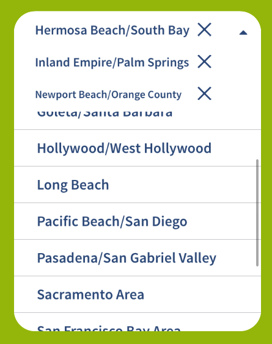
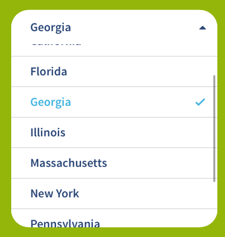

# SelectableView






## Installation

`SelectableView` is available through [CocoaPods](https://cocoapods.org/pods/SelectableView). To install
it, simply add the following line to your Podfile:

```ruby
pod "SelectableView"
```

If you used `use_framework` in your podfile just simply do:

```Swift
import SelectableView

```

for every file when you need to use it.

you may also use:

```Swift
@import SelectableView;

```

within **bridging header** file and avoid to import framework for every needed file.

##Info   


- entirely written in latest Swift syntax.

##Usage

Simply add `SingleSelectableView`, `MultiSelectableView` or `SearchSelectableView` as a subclass of your `UIView` in Interface Builder.

#### Connect following `@IBOutlets`:

```Swift
@IBOutlet open var switchButton: UIButton?
@IBOutlet open var contentOptionsHeightConstraint: NSLayoutConstraint?
@IBOutlet open var contentOptionsView: UIView?
@IBOutlet open var selectedOptionLabel: UILabel? //only SingleSelectableView
@IBOutlet open var verticalTokenView: VerticalTokenView? //only MultiSelectableView
@IBOutlet open var horizontalTokenView: HorizontalTokenView?  //only MultiSelectableView
@IBOutlet open var tokenViewHeightConstraint: NSLayoutConstraint? //only MultiSelectableView, useful within UIScrollView
@IBOutlet open var textField: UITextField! //only SearchSelectableView
```

#### Assing delegates for your selectable views in `viewDidLoad()`:

```Swift
singleSelectableView.delegate = self
multiSelectableView.delegate = self
searchSelectableView.delegate = self
```

#### Conform your `UIViewController` to `SelectableViewDelegate` declared as following:

```Swift
@objc public protocol SelectableViewDelegate {
    
    @objc optional func multiSelectableView(_ view: MultiSelectableView, tokenViewFor option: SelectableOption) -> UIView
    
    @objc optional func singleSelectableView(_ view: SingleSelectableView, didSelect option: SelectableOption)
    @objc optional func multiSelectableView(_ view: MultiSelectableView, didSelect option: SelectableOption)
    @objc optional func searchSelectableView(_ view: SearchSelectableView, didSelect option: SelectableOption)
    @objc optional func selectableViewDidToggleOptions(with button: UIButton, expanded: Bool)
}
```

#### Additionally in Interface Builder you may set up for every `SelectableView` the following properties:

```Swift
    var fontForOption = UIFont.systemFont(ofSize: 16)
    var fontForPlaceholderText = UIFont.systemFont(ofSize: 14)
    
    @IBInspectable open var leftPaddingForPlaceholderText = 0
    @IBInspectable open var leftPaddingForOption = 20
    @IBInspectable open var heightForOption = 40
    
    @IBInspectable open var titleColorForSelectedOption = UIColor.green
    @IBInspectable open var titleColorForOption = UIColor.black
    @IBInspectable open var textColorForPlaceholderText = UIColor.gray
    @IBInspectable open var tintColorForSelectedOption = UIColor.blue
    
    @IBInspectable open var identifier = ""
    @IBInspectable open var tableViewAccessibilityIdentifier = ""
    @IBInspectable open var maxNumberOfRows = 6
    @IBInspectable open var placeholder = ""
```

#### If you need you are able to call public instance methods:

```Swift
open func hideOptions() //collapse selectable options
open func select(option: SelectableOption) //only MultiSelectableView
open func deselect(option: SelectableOption) //only MultiSelectableView
```

#### You have access to the following properties:

```Swift
open var options: [SelectableOption]? //current list of options able to select it
open var selectedOption: SelectableOption? //SingleSelectableView, SearchSelectableView
open var selectedOptions = [SelectableOption]() //MultiSelectableView
```

#### `SelectableOption` is defined as follows:

```Swift
open class SelectableOption: NSObject {
    
    open var index: Int
    open var identifier: String
    open var title: String
    open var userInfo: [AnyHashable: Any]?
    
    open var descendantOptions = [SelectableOption]()
    
    public init(index: Int, title: String, identifier: String, userInfo: [AnyHashable: Any]? = nil) {
        
        self.index = index
        self.identifier = identifier
        self.title = title
        self.userInfo = userInfo
    }
}
```

## Author

Bartłomiej Semańczyk, bartekss2@icloud.com

## License

`SelectableView` is available under the MIT license. See the LICENSE file for more info.
